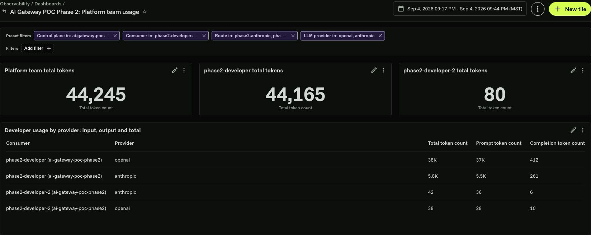

# POC results

The POC demonstrates Anthropic and OpenAI through Konnect AI Gateway, with
individual credentials, shared team allowances, and restricted GitHub tool
access. The results below summarize checks completed during the POC. Use
[VALIDATION.md](VALIDATION.md) to repeat them in your environment.

## Demonstrated outcomes

| Capability | Observed result in both phases |
| --- | --- |
| Client workflows | Claude Code and Codex completed inference and a successful, nonempty GitHub `get_file_contents` read. Konnect recorded the corresponding model and MCP Route traffic. |
| Access controls | Missing or invalid credentials, spoofed team membership, unapproved models, and unauthorized tool calls were rejected. |
| Team allowances | Two platform developers shared each provider's token allowance, including streaming usage. At a reduced test limit, both were blocked while the other team and provider remained usable. Original allowances were restored. |
| Request redaction | Tested ordinary messages, history, and text blocks were redacted. Tool-output gaps and false positives remain; see below. |
| Deployment health | Both data planes were Connected, In sync, and Compatible after validation. Temporary resources were removed, and the refreshed Phase 2 Terraform plan reported no changes. |

The traffic views illustrate the client workflows:
[Phase 1 traffic](phase-1/evidence/phase-1-traffic.png) and
[Phase 2 traffic](phase-2/evidence/phase-2-traffic.png).

## Team and individual usage

The Phase 2 dashboard shows a platform-team total, individual developer totals,
and usage by Consumer and provider. Its recorded POC sample reconciles as follows:

| Member or total | Tokens |
| --- | ---: |
| `phase2-developer` | 44,165 |
| `phase2-developer-2` | 80 |
| Sum of individual usage | 44,245 |
| Konnect team aggregate | 44,245 |

Prompt tokens (43,556) plus completion tokens (689) also total 44,245.

The dashboard filters the two managed model Routes to the platform team's
Consumers. Update the saved Consumer filter when membership changes. Follow the
[dashboard guide](phase-2/observability/README.md) to reproduce this view. This
demonstrates usage attribution; monetary billing is outside the POC.

## Redaction limitations

Native sanitizer checks reproduced these outcomes in both phases using synthetic
fixtures and a local mock upstream:

| Input | Observed result |
| --- | --- |
| Ordinary Anthropic messages and OpenAI input, including history and text blocks | Synthetic email and password redacted. |
| Anthropic `messages[].content[type=tool_result].content` | **KNOWN LIMITATION:** synthetic email and password unchanged. |
| OpenAI `input[type=function_call_output].output` | **KNOWN LIMITATION:** synthetic email and password unchanged. |
| Benign references to `Kong/kong` and `README.md` | **KNOWN LIMITATION:** replaced with placeholders, altering the intended tool request. |
| Public `github/gitignore` root-readme request | Unchanged and usable. |

An unreachable sanitizer returned an error without forwarding the diagnostic
request upstream. That behavior does not address the tool-output gaps above.
Sensitive tool outputs remain unsuitable for this workflow. See the
[writeup](WRITEUP.md#limitations-and-production-adoption) for the adoption
boundaries, including shared counters, identity, and provider retention.
